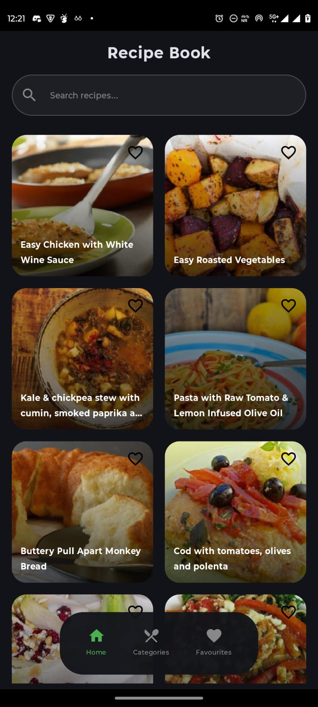
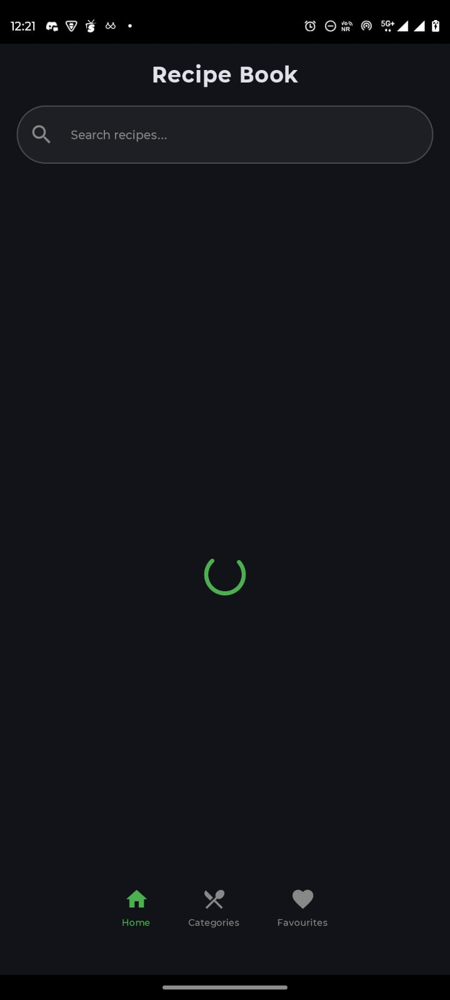
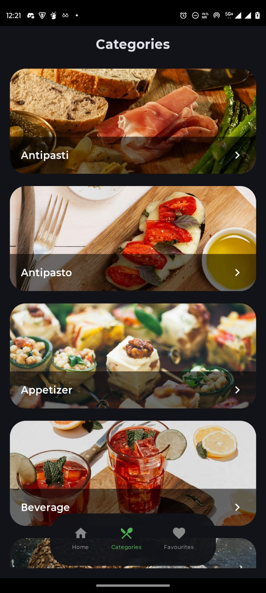
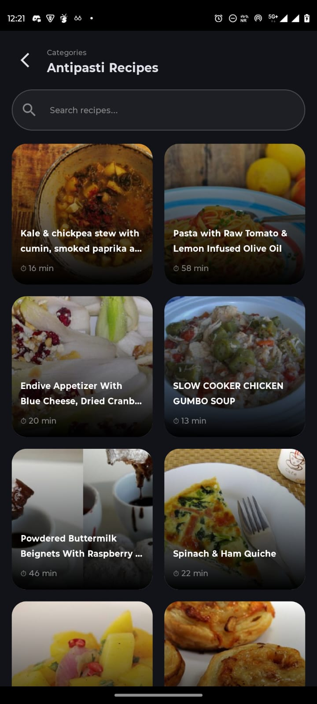
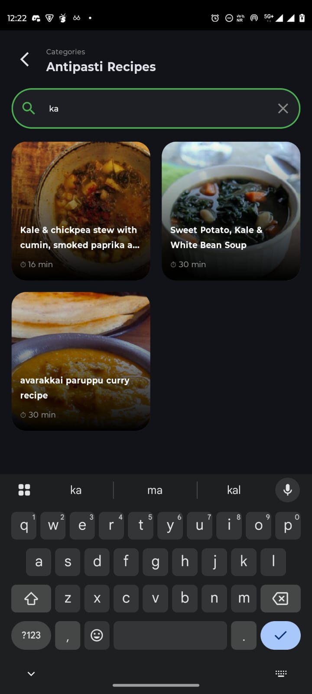
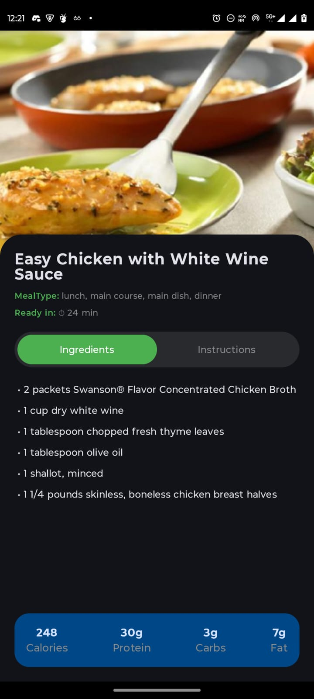
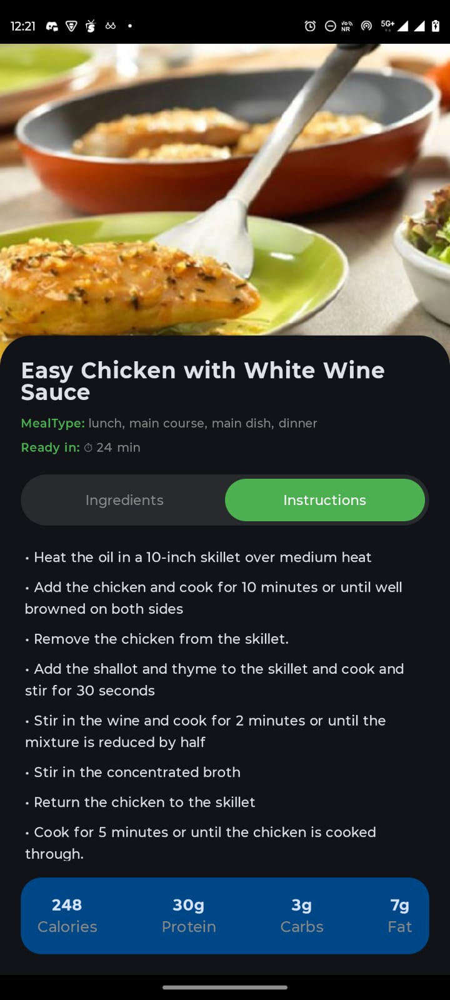
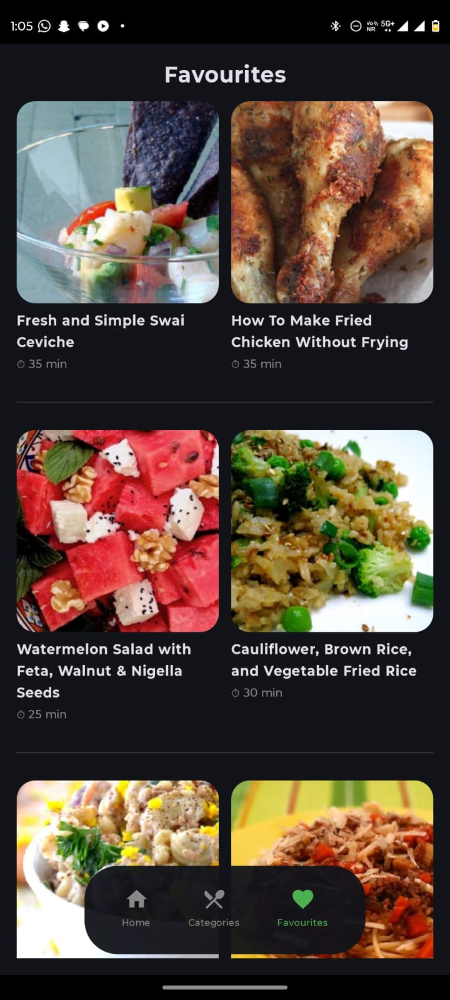

# RecipeBook 🍽️

RecipeBook is a modern Android recipe application built using Kotlin and Jetpack Compose.
The app follows MVVM architecture and allows users to discover recipes, browse categories, search recipes, view detailed cooking instructions, nutritional information, and save favorite recipes, and previously fetched recipes offline.

## Features

### Home Screen
- Browse recipes from Spoonacular API
- Beautiful recipe cards with images
- Loading states
- Offline access to previously loaded recipes

### Search
- Search recipes by name
- Instant filtering results

### Categories
- Browse recipes by category
- Dedicated category recipe screen

### Recipe Details
- Large recipe image
- Ingredients list
- Cooking instructions
- Preparation time
- Meal type information
- Nutrition information

### Nutrition Information
- Calories
- Protein
- Carbohydrates
- Fat

### Favorites
- Save recipes locally
- Remove recipes from favorites
- Offline access using Room Database

### Offline Support
- Previously fetched recipes remain available without internet connection
- Favorite recipes are stored locally using Room Database
- Users can continue browsing cached recipes even when offline
- Improved user experience during network unavailability

### Theme Support
- Supports both Light and Dark themes based on device settings

### Data Handling
- Fetches recipes from Spoonacular API
- Handles missing or invalid recipe images gracefully
- Displays loading states during network requests
- Processes API responses before displaying data

## Tech Stack

### Language
- Kotlin

### UI
- Jetpack Compose
- Material Design

### Architecture
- MVVM Architecture

### Networking
- Retrofit
- Gson

### Database
- Room Database

### Image Loading
- Coil

### API
- Spoonacular API

## Screenshots

### Home Screen


### Loading State


### Categories Screen


### Category Recipes Screen


### Search Feature


### Recipe Ingredients 


### Recipe Instructions


### Favorites Screen


## Project Structure

- UI Layer
- ViewModel Layer
- Repository Layer
- API Layer
- Database Layer

## Getting Started

1. Clone the repository

```bash
git clone https://github.com/SS007008/RecipeBook.git
```

2. Add your Spoonacular API key in local.properties

```properties
SPOONACULAR_API_KEY=YOUR_API_KEY
```

3. Sync Gradle

4. Run the application

## Future Improvements

- User accounts and personalized recipe collections
- Recipe sharing functionality
- Meal planner and weekly meal scheduling
- Vegetarian / Non-Vegetarian filtering in category recipes
- Sort favorite recipes by newest or oldest added
- Toast notifications when recipes are added to or removed from favorites
- Advanced recipe filtering options
- Recently viewed recipes history

## Author

Satyam Solanki

## License

Educational and portfolio project.
